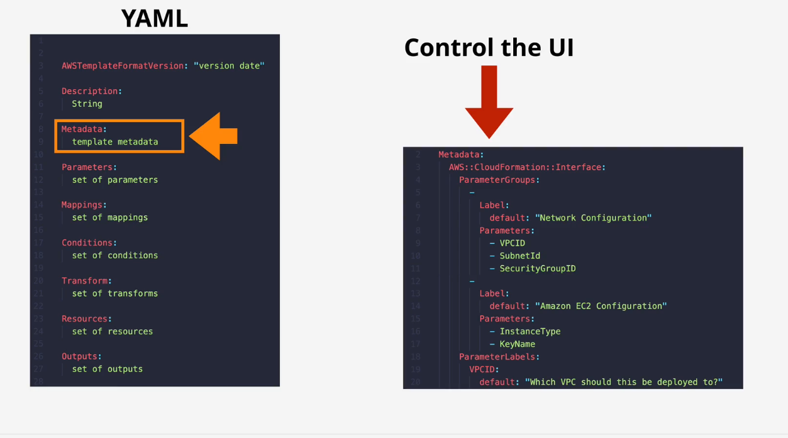
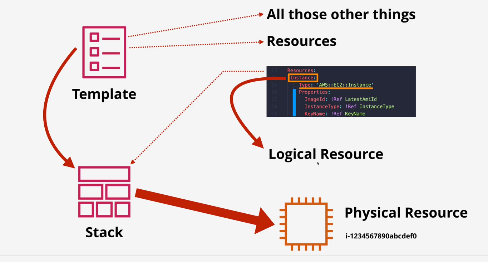
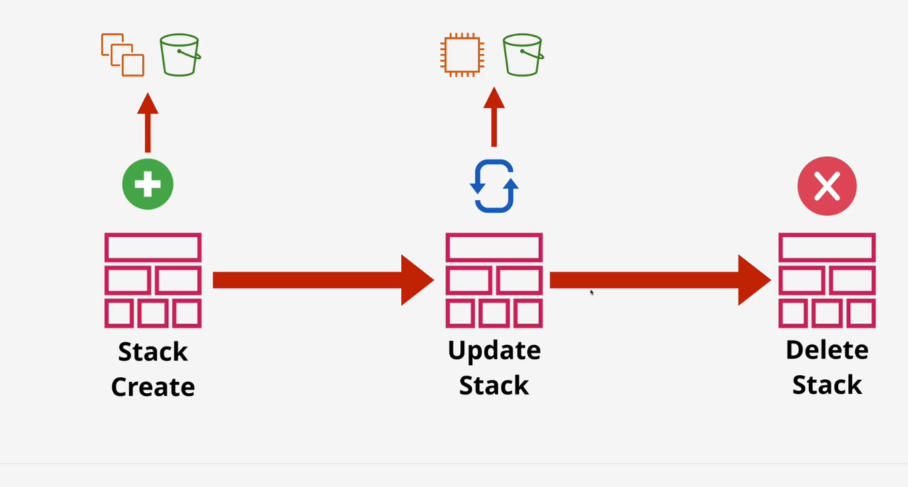

# AWS CloudFormation

## What is CloudFormation?

AWS CloudFormation is an Infrastructure as Code (IaC) service used to automate the creation, configuration, updating, and deletion of AWS infrastructure using templates.

Instead of manually creating resources through the AWS Console, you define the desired infrastructure in a CloudFormation template, and CloudFormation creates and manages the resources described by that template.

## CloudFormation Template

```text
↓
CloudFormation
↓
```
Stack
```text
↓
AWS Resources
```

### What is a template?

A CloudFormation template is a YAML or JSON document that declaratively describes the AWS resources and configuration you want CloudFormation to create and manage.

"Declarative" means:

You describe what you want, rather than writing step-by-step instructions for how CloudFormation should create it.

For example, you can declare:

```yaml
Resources:
MyInstance:
Type: AWS::EC2::Instance
```

You are saying:

> "I want an EC2 instance of this type."

CloudFormation determines the underlying API operations needed to create it.

# CloudFormation Template Components

A CloudFormation template can contain several sections.

Template
```text
│
├── AWSTemplateFormatVersion
├── Description
├── Metadata
├── Parameters
├── Mappings
├── Conditions
├── Resources
└── Outputs
```



Not every template needs every section.

## 1. AWSTemplateFormatVersion

Specifies the version of the CloudFormation template format.

```yaml
AWSTemplateFormatVersion: '2010-09-09'
```

The currently supported template format version is `2010-09-09`.

**Exam point**

It is optional.

## 2. Description

Provides a human-readable description of the template.

```yaml
Description: Creates an EC2 instance
```
**Important exam point**

If AWSTemplateFormatVersion is present, Description must immediately follow it.

Correct:

```yaml
AWSTemplateFormatVersion: '2010-09-09'
Description: Creates an EC2 instance
```

Don't put another top-level section between them.

## 3. Metadata

Provides additional information about the template.

```yaml
Metadata:
...
```

It does not normally define the AWS infrastructure itself.

```yaml
One important use is configuring how parameters are presented in the CloudFormation console, such as with AWS::CloudFormation::Interface.
```

## 4. Parameters

Allows values to be supplied when creating or updating a stack.

For example:

```yaml
Parameters:
InstanceType:
Type: String
Default: t3.micro
```

Instead of hardcoding the instance type, the user can provide it when launching the stack.

Think:

> **Parameters = inputs to the template.**

## 5. Mappings

Contains fixed key-value mappings that the template can look up.

A common example is mapping:

```text
Region → AMI ID
```

For example:

```text
us-east-1 → AMI-A
eu-west-1 → AMI-B
```

Then the template can select the appropriate value based on the Region.

Think:

> **Mappings = lookup table.**

## 6. Conditions

Defines conditional logic that determines whether certain resources or properties should be used.

For example:

Environment = Production
```text
↓
```
Create production-only resource

Think:

> **Conditions = "Should this thing be created/configured?"**

## 7. Resources ⭐

Resources are the most important section.

The Resources section defines the AWS resources that CloudFormation should create and manage.

Example:

```yaml
Resources:
MyInstance:
Type: AWS::EC2::Instance
Properties:
InstanceType: t3.micro
```

There are three important concepts here:

### Logical ID

`MyInstance`:

This is the logical ID.

It is the identifier CloudFormation uses to refer to this resource inside the template/stack.

### Type

```yaml
Type: AWS::EC2::Instance
```

The type tells CloudFormation what kind of AWS resource this is.

Here:

```yaml
AWS::EC2::Instance
↓
EC2 instance
```

### Properties

```yaml
Properties:
InstanceType: t3.micro
```

Properties define the configuration of the resource.

So:

```text
Logical ID → What CloudFormation calls it
Type       → What AWS resource it represents
Properties → How that resource is configured
```

# CloudFormation Architecture





# Template → Stack → Physical Resources

This is probably the most important CloudFormation mental model.

TEMPLATE
```text
│
│
▼
CloudFormation
│
▼
STACK
│
┌─────────┼─────────┐
▼         ▼         ▼
```
Logical     Logical    Logical
Resource    Resource   Resource
```text
│         │         │
▼         ▼         ▼
```
Physical     Physical   Physical
Resource     Resource   Resource
```text
│         │         │
▼         ▼         ▼
AWS        AWS        AWS
Resource   Resource   Resource
Logical Resources
```

The resources defined inside a CloudFormation template are represented as logical resources.

For example:

```yaml
Resources:
WebServer:
Type: AWS::EC2::Instance
```

Here:

`WebServer`
```text
↓
```

### Logical ID

```text
↓
```
Logical resource

It has:

### Type

```text
↓
AWS::EC2::Instance
```

### Properties

```text
↓
```
Instance configuration

CloudFormation uses this definition to create the corresponding AWS resource.

## Physical Resources

When CloudFormation processes the template and creates the stack, it creates the actual AWS resources represented by those logical resources.

For example:

Logical Resource
`WebServer`
```text
↓
Physical Resource
```
EC2 instance
`i-0123456789...`

The physical resource is the real AWS resource that exists in your account.

So:

Logical resource = CloudFormation's representation of the resource in the template/stack.

Physical resource = the actual AWS resource created in your AWS account.

# What is a Stack?

When you give CloudFormation a template and ask it to create infrastructure, CloudFormation creates a stack.

A stack is a collection of AWS resources that CloudFormation manages together according to a template.

Think of it as:

Template
```text
↓
CloudFormation
↓
```
Stack
```text
│
├── EC2 logical resource → EC2 physical resource
├── S3 logical resource  → S3 physical resource
└── IAM logical resource → IAM physical resource
```

### Important mental model

> **The template is the blueprint/definition.**

> **The stack is the deployed instance of that template that CloudFormation manages.**

# One Template → Multiple Stacks

A single template can be used to create multiple stacks.

For example:

## CloudFormation Template

```text
│
┌───────────┼───────────┐
▼           ▼           ▼
```
Stack A      Stack B      Stack C
```text
│           │           │
```
Dev env      Test env     Prod env

The same template could therefore be used to create separate environments.

The stacks are separate deployments even though they originated from the same template.

# What happens when you create a stack?

Suppose your template says:

Create:
- EC2 instance
- S3 bucket
- Security Group

CloudFormation:

1. Reads the template
```text
↓
```
2. Creates the stack
```text
↓
```
3. Creates logical resources
```text
↓
4. Creates the corresponding physical AWS resources
```

Result:

Stack
```text
│
├── WebServer → actual EC2 instance
├── Bucket    → actual S3 bucket
└── SG        → actual Security Group
```

# What happens when you update the template?

This is another important concept.

Suppose your original template says:

EC2
InstanceType = `t3.micro`

You change the template:

EC2
InstanceType = `t3.small`

You then update the stack using the new template.

Conceptually:

Old Template
```text
↓
Existing Stack
↓
Existing Physical Resources
```

UPDATE

New Template
```text
↓
CloudFormation compares desired state
↓
```
Updates required resources
```text
↓
New Physical Resources / configurations
```

CloudFormation determines what changes are required and performs the necessary create/update/delete operations.

### Important correction to your original wording

You said:

> "when you update the template, the logical resources of template get changes"

I'd phrase it as:

When you update a stack with a new template, CloudFormation compares the new desired configuration with the existing stack and makes the necessary changes to the physical resources.

Depending on the resource and property being changed, CloudFormation may:

- Update the existing physical resource
- Create a replacement resource
- Delete a resource
- Create additional resources

This distinction is very important for the exam.

# What happens when you delete a stack?

When you delete a CloudFormation stack:

Stack
```text
│
├── Logical Resource A
├── Logical Resource B
└── Logical Resource C
```

CloudFormation normally deletes the physical resources managed by that stack as well.

Delete Stack
```text
↓
CloudFormation
↓
```
Delete managed physical resources

So:

Deleting a stack normally deletes the resources in that stack.

### Important exception

Some resources can be configured with a `DeletionPolicy`, such as:

```yaml
DeletionPolicy: Retain
```

In that case, the physical resource can be retained even when the stack is deleted.

This is an important exam concept.

# ⭐ The CloudFormation Mental Model

This is the part I'd memorize:

TEMPLATE
> "Here is what I want."
```text
↓
```
CLOUDFORMATION
> "Manage this infrastructure."
```text
↓
STACK
```
> "Active deployment/managed instance of the template."
```text
↓
```
LOGICAL RESOURCES
> "What resources does the stack contain?"
```text
↓
```
PHYSICAL RESOURCES
> "The actual AWS resources."

### In one sentence:

A CloudFormation template is a YAML/JSON definition of desired AWS infrastructure; CloudFormation uses that template to create a stack, the stack contains logical resources, and CloudFormation creates and manages the corresponding physical AWS resources.

# Important SAA / Exam Points

## 1. CloudFormation is Infrastructure as Code

You define infrastructure in code rather than manually creating it.

Benefits include:

- Repeatability
- Automation
- Consistency
- Version control
- Easier updates
- Easier environment replication

## 2. CloudFormation is declarative

You describe the desired state.

You generally don't tell CloudFormation:

1. Call API X
2. Wait
3. Create resource Y
4. Configure Z

Instead:

> "I want this EC2 instance with these properties."

CloudFormation determines how to achieve that desired state.

## 3. Stack = managed unit

A stack is the unit CloudFormation uses to create, update, and delete a collection of resources together.

## 4. Logical ID ≠ Physical ID

Very important:

Logical ID:
My`WebServer`

Physical ID:
`i-0abc123456...`

The logical ID is from your template.

The physical ID identifies the actual AWS resource.

## 5. One template can create multiple stacks

Template
```text
├── Dev Stack
├── Test Stack
└── Production Stack
```

Useful for creating consistent environments.

## 6. Updating a stack doesn't necessarily mean modifying the same physical resource

Depending on what changed, CloudFormation can:

Update existing resource
```text
OR
Replace resource
```
```text
OR
Create/delete resources
```

This is why resource update/replacement behavior matters in CloudFormation questions.

## 7. CloudFormation manages the lifecycle

The key lifecycle is:

CREATE
```text
↓
UPDATE
↓
UPDATE
↓
DELETE
```

CloudFormation manages the resources throughout this lifecycle.

## 8. Don't confuse template and stack

Template:

> **The definition/blueprint.**

Stack:

> **The deployed CloudFormation-managed collection of resources based on that definition.**

## 9. Don't confuse logical and physical resources

Logical resource:

The resource definition/representation inside CloudFormation.

Physical resource:

> **The actual AWS resource created in your account.**
